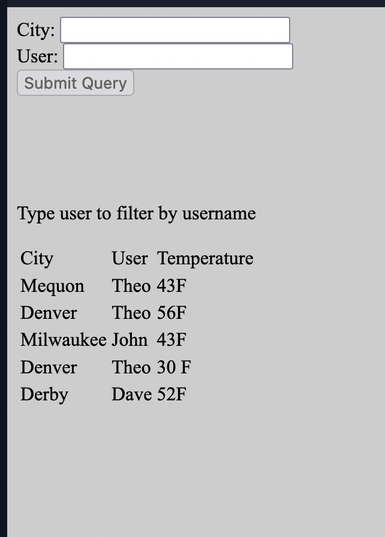
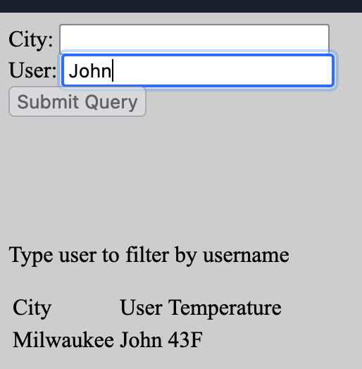

## Django Weather App

This is a simple weather app that allows a user to keep track of weather data. The site contains a list of cities and user and the temperature of the city.

### Technologies
- Django
- AJAX
- JQuery
- HTML, CSS

#### Features
- Filtering
- Temperature lookup
- Error checking

#### Filterings
By default all cities and all users with be visible but once the user types a name in the user field the site will auto filter to that user.

#### Temperature lookup

This allows users to lookup one or more cities using one interface additionally, the page will auto update.

#### Error Checking
If the user spells the city wrong the program will not allow submission until corrected.
